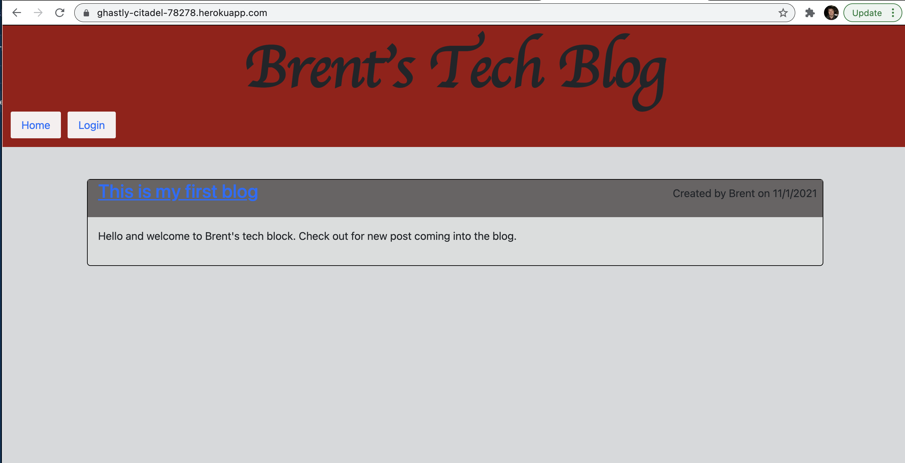

# Model View Controler: Tech Blog

  

  ## Description

  Creating a tech blog with MVC layout to connect to a mySQL Database. Built with mySQL, Sequelize, express, Handlebars and dotenv.
  
  Click the link below to visit my deployed page.

 https://ghastly-citadel-78278.herokuapp.com/

  ## Table of Contents
  
  * [Goals](#goals)
  * [Usage](#usage) 
  * [Installation](#installation)  
  * [Test](#test)
  * [Problems](#problems)
  * [Visualization](#visualization)
  * [Acknowledgements](#acknowledgements)
  * [Contributions](#contributions)
  * [Resources](#resources)
  * [License](#license) 
  * [Contact](#contact) 
  
  ## Goals

  To utilize deployment of heroku with SQL an application that can save login information as well as inputs as a tech blog.

  ## Usage

  A tech blog wear people can register and input entries onto the site.

  ## Installation
  
  npm start also make sure you are connected to local server and that has your database created.

  ## Test

  no test are needed for the application

  ## Problems

  The most difficulty I had was deploying the page to heroku. I learned that changing lower case to an uppercase in github does not recognize the change right away because github does not recognize changes from uppercase to lowercase."

  ## Visualization

Mockup of page:

Expected MVC Connections

NPM Start outcome in terminal connected to host 3001

Homepage of Deployed Heroku Site.

Login  a username email and password must be created to assess the full functionality of the site

Create a post

Edit a post

Delete a post

Updated Post

  ## Acknowledgements

  Brent Graves Fenix Sampson Dan Rosenbaum, Gabriel Cavalcante Causin, and John Dinsmore

  ## Contributions

  submit a fork request you are welcome to submit code from another branch.

  ## Resources
 
  Eloquent Javascript, Stack Overflow, inclass project and activities

  ## License

  Copyright 2021 Brent Graves

  Permission is hereby granted, free of charge, to any person obtaining a copy of this software and associated documentation files (the "Software"), to deal in the Software without restriction, including without limitation the rights to use, copy, modify, merge, publish, distribute, sublicense, and/or sell copies of the Software, and to permit persons to whom the Software is furnished to do so, subject to the following conditions:
  
  The above copyright notice and this permission notice shall be included in all copies or substantial portions of the Software.
  
  THE SOFTWARE IS PROVIDED "AS IS", WITHOUT WARRANTY OF ANY KIND, EXPRESS OR IMPLIED, INCLUDING BUT NOT LIMITED TO THE WARRANTIES OF MERCHANTABILITY, FITNESS FOR A PARTICULAR PURPOSE AND NONINFRINGEMENT. IN NO EVENT SHALL THE AUTHORS OR COPYRIGHT HOLDERS BE LIABLE FOR ANY CLAIM, DAMAGES OR OTHER LIABILITY, WHETHER IN AN ACTION OF CONTRACT, TORT OR OTHERWISE, ARISING FROM, OUT OF OR IN CONNECTION WITH THE SOFTWARE OR THE USE OR OTHER DEALINGS IN THE SOFTWARE.

  ## Contact
  
GitHub Username: grave019
 
Link to Github account[grave019](https://github.com/grave019)

  Email: brent.r.graves82@gmail.com
